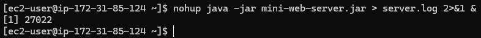
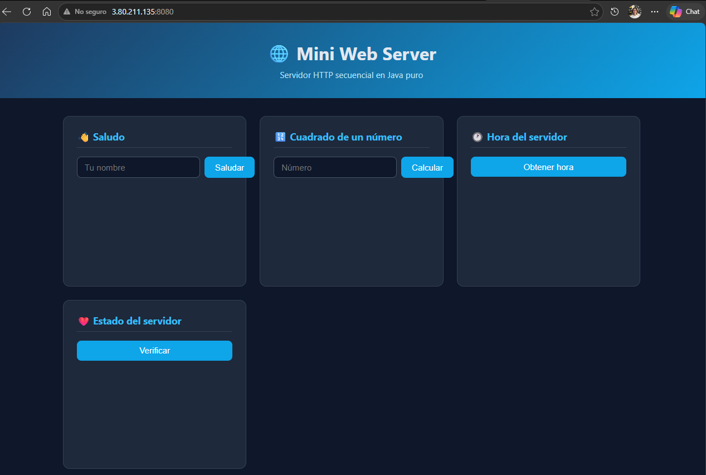
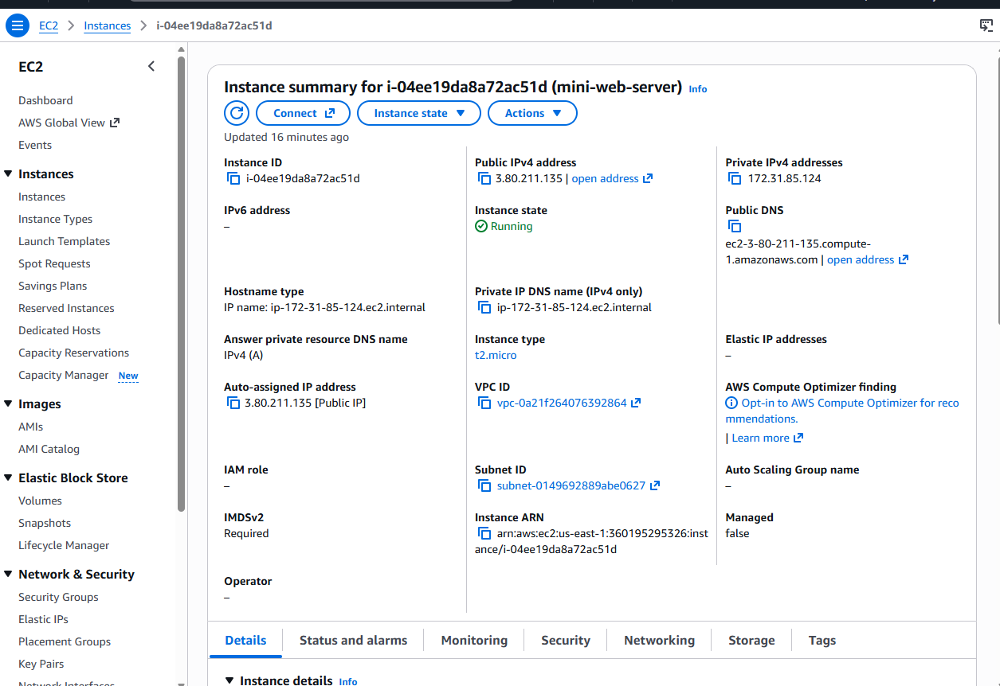

# 🌐 Mini Web Server

Servidor HTTP secuencial implementado en Java puro, sin frameworks externos.
Sirve recursos estáticos y expone servicios dinámicos mediante rutas hardcodeadas.

---

## 📖 Descripción

Este proyecto implementa un servidor HTTP desde cero usando `ServerSocket` de Java.
El servidor procesa una conexión a la vez (secuencial) y demuestra cómo funciona
el protocolo HTTP internamente: parseo de requests, content-types, query strings y responses.

---

## 🏛️ Metáfora del sistema

El servidor funciona como una **oficina de atención al público**:

| Metáfora | Componente |
|----------|------------|
| Recepcionista | `ServerSocket` — recibe cada visitante (conexión TCP) |
| Ventanilla de trámites | Rutas dinámicas — `/api/greeting`, `/api/square`, `/api/time`, `/api/health` |
| Archivo de documentos | Recursos estáticos — HTML, CSS, JS, imágenes en `/webroot` |
| Formulario de solicitud | HTTP Request — método, path, query string |
| Respuesta oficial | HTTP Response — status, content-type, body |
| Oficina en edificio remoto | AWS EC2 — el mismo servidor corriendo en la nube |

La oficina atiende un cliente a la vez. Mientras atiende uno, los demás esperan en fila.

---

## 🏗️ Arquitectura

```
Browser
   │
   │  HTTP Request (GET /api/greeting?name=Juan)
   ▼
ServerSocket (puerto 8080)
   │
   ▼
HttpServer.handleRequest()
   │
   ├── ¿Es ruta dinámica?
   │     ├── /api/greeting  → handleGreeting()  → JSON
   │     ├── /api/square    → handleSquare()    → JSON
   │     ├── /api/time      → handleTime()      → JSON
   │     └── /api/health    → handleHealth()    → JSON
   │
   └── ¿Es archivo estático?
         ├── /index.html      → webroot/index.html
         ├── /styles.css      → webroot/styles.css
         ├── /app.js          → webroot/app.js
         ├── /images/logo.png → webroot/images/logo.png
         └── desconocido      → 404 Not Found
```

---

## 📁 Estructura del proyecto

```
mini-web-server/
├── pom.xml
├── README.md
├── .gitignore
├── imgs/
│   ├── evd01-server-running-ec2.png
│   ├── evd02-app-deployed-ec2.png
│   └── evd03-aws-instance.png
└── src/
    ├── main/
    │   ├── java/
    │   │   └── co/edu/escuelaing/
    │   │       ├── server/
    │   │       │   └── HttpServer.java
    │   │       └── app/
    │   │           └── App.java
    │   └── resources/
    │       └── webroot/
    │           ├── index.html
    │           ├── styles.css
    │           ├── app.js
    │           └── images/
    │               └── logo.png
    └── test/
        └── java/
            └── co/edu/escuelaing/
                └── AppTest.java
```

---

## ⚙️ Prerrequisitos

- Java 17+
- Maven 3.8+

---

## 🚀 Cómo ejecutar localmente

**1. Clonar el repositorio:**
```bash
git clone https://github.com/juanpablo012501/mini-web-server.git
cd mini-web-server
```

**2. Compilar:**
```bash
mvn clean package -DskipTests
```

**3. Ejecutar:**
```bash
java -jar target/mini-web-server.jar
```

**4. Abrir en el navegador:**
```
http://localhost:8080
```

---

## 🌍 Variables de entorno

| Variable | Propósito | Valor por defecto |
|----------|-----------|-------------------|
| `PORT` | Puerto del servidor HTTP | `8080` |

---

## 🔗 Endpoints disponibles

### Recursos estáticos

| URL | Descripción |
|-----|-------------|
| `GET /` | Página principal |
| `GET /index.html` | Página HTML |
| `GET /styles.css` | Estilos CSS |
| `GET /app.js` | JavaScript cliente |
| `GET /images/logo.png` | Imagen logo |

### Servicios dinámicos

| URL | Parámetros | Respuesta |
|-----|------------|-----------|
| `GET /api/greeting?name=Juan` | `name` (requerido) | `{"greeting": "Hello, Juan!"}` |
| `GET /api/square?value=5` | `value` (requerido) | `{"input": 5.0, "square": 25.0}` |
| `GET /api/time` | ninguno | `{"serverTime": "2026-09-21 15:24:16"}` |
| `GET /api/health` | ninguno | `{"status": "ok"}` |

---

## 🧪 Pruebas realizadas

| Prueba | URL | Resultado |
|--------|-----|-----------|
| Página principal | `GET /` | ✅ 200 OK |
| Saludo válido | `GET /api/greeting?name=Juan` | ✅ 200 JSON |
| Cuadrado válido | `GET /api/square?value=15` | ✅ 200 JSON |
| Hora del servidor | `GET /api/time` | ✅ 200 JSON |
| Health check | `GET /api/health` | ✅ 200 JSON |
| Archivo faltante | `GET /noexiste.html` | ✅ 404 Not Found |
| Parámetro faltante | `GET /api/greeting` | ✅ 400 Bad Request |
| Número inválido | `GET /api/square?value=abc` | ✅ 400 Bad Request |
| Path traversal | `GET /../etc/passwd` | ✅ 403 Forbidden |

---

## ☁️ Deploy en AWS EC2

**Plataforma:** Amazon Web Services — EC2  
**Sistema operativo:** Amazon Linux 2023  
**Tipo de instancia:** t2.micro  
**URL pública:** `http://3.80.211.135:8080`

### Pasos para reproducir el deploy:

**1. Lanzar instancia EC2** con Amazon Linux 2023, t2.micro

**2. Configurar Security Group** — abrir puerto 8080 (Custom TCP, 0.0.0.0/0)

**3. Conectarse por SSH:**
```bash
ssh -i "mini-web-server-key.pem" ec2-user@3.80.211.135
```

**4. Instalar Java 17:**
```bash
sudo yum install -y java-17-amazon-corretto
```

**5. Subir el JAR:**
```bash
scp -i "mini-web-server-key.pem" target/mini-web-server.jar ec2-user@3.80.211.135:~/
```

**6. Ejecutar en background:**
```bash
nohup java -jar mini-web-server.jar > server.log 2>&1 &
```

---

## 📸 Evidencias

### Servidor corriendo en EC2


### Aplicación desplegada y accesible públicamente


### Instancia EC2 en consola AWS


---

## 💬 Preguntas de reflexión

**1. ¿Por qué una sola página HTML genera varias peticiones HTTP?**  
Porque el navegador primero descarga el HTML y al leerlo descubre referencias a otros recursos (CSS, JS, imágenes) que debe solicitar por separado.

**2. ¿Por qué las imágenes deben tratarse como bytes y no como texto?**  
Las imágenes son datos binarios. Leerlas como texto corrompe su contenido porque los codificadores de caracteres modifican ciertos bytes.

**3. ¿Cuál es el rol del Content-Type en la respuesta?**  
Le indica al navegador cómo interpretar el cuerpo de la respuesta: si es HTML lo renderiza, si es JS lo ejecuta, si es PNG lo muestra como imagen.

**4. ¿Qué está hardcodeado y qué generalizaría un framework de routing?**  
Las rutas están en condicionales `if/else` directamente en el loop. Un framework generalizaría el mapeo path → handler mediante un registro dinámico (como lambdas o anotaciones).

**5. ¿Por qué el navegador puede ser asíncrono mientras el servidor es secuencial?**  
JavaScript usa `fetch()` de forma no bloqueante en el navegador, pero eso no afecta al servidor que sigue atendiendo una conexión a la vez.

**6. ¿Qué cambió al mover el servidor a EC2? ¿Qué no cambió?**  
Cambió la dirección de red (IP pública) y el entorno de ejecución. No cambió nada del código ni la arquitectura.

**7. ¿Qué pasa cuando dos usuarios envían peticiones lentas al mismo tiempo?**  
El segundo usuario espera en cola hasta que el servidor termine de atender al primero, porque el servidor es secuencial.

**8. ¿Cuál es la siguiente limitación a resolver y por qué la concurrencia va antes que el balanceo de carga?**  
La concurrencia. Un balanceador de carga distribuye trabajo entre múltiples servidores, pero si cada servidor solo maneja una conexión a la vez el problema persiste. Primero hay que hacer que un servidor pueda manejar múltiples conexiones simultáneas.

---

## ⚠️ Limitaciones conocidas

- El servidor es **secuencial**: procesa una conexión a la vez.
- No soporta HTTPS.
- Las rutas están **hardcodeadas** intencionalmente para exponer el mecanismo de routing.
- No es un servidor de producción.

---

## 👤 Autor

**Juan Pablo Velez Munoz**  
Escuela Colombiana de Ingeniería Julio Garavito  
Laboratorio AREP
